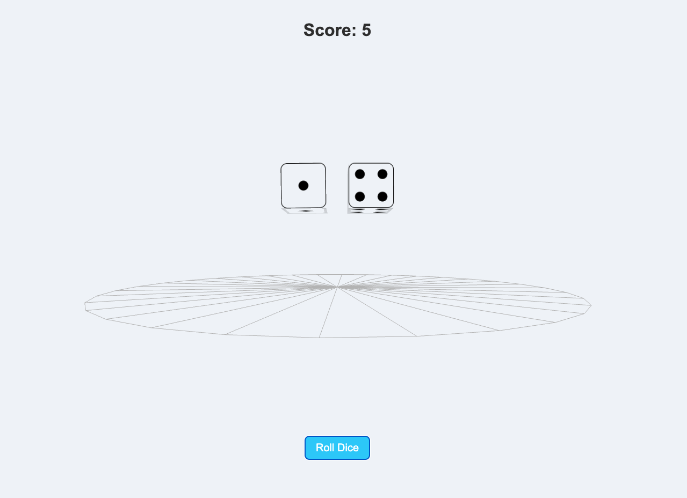

# 3D Dice Roller - Three.js



## 🌐 Live Demo
[View the project on GitHub Pages](https://moontags.github.io/Dice_Roller_Program/)

## 📖 About the Project
This project is a **3D Dice Roller** built using **Three.js**. The application simulates rolling two dice in a visually appealing 3D space with real-time animations and a wireframe background. The results of the dice roll are displayed on the screen, ensuring accurate values based on the rendered dice.

## 🚀 Technologies Used
- **HTML5** - Structure of the webpage
- **CSS3** - Styling and layout adjustments
- **JavaScript (ES6+)** - Core logic for dice rolling and animation
- **Three.js** - 3D rendering and physics simulation
- **GitHub Pages** - Hosting the project online

## 🛠 Features
- 🎲 **Realistic 3D dice rolling with smooth animations**
- 🎨 **Custom textures for dice faces**
- 🔄 **Spinning wireframe background for visual effect**
- 📱 **Responsive design to work on all devices**
- 🎭 **Shadows and lighting effects for realism**
- ✅ **Accurate dice results synced with displayed values**

## 📂 File Structure
```
/3D-Dice-Roller
│── index.html         # Main HTML file
│── styles.css         # CSS styling
│── script.js         # JavaScript logic
│── images/           # Folder for dice face textures and preview images
│   │── Dice-1-b.svg
│   │── Dice-2-b.svg
│   │── Dice-3-b.svg
│   │── Dice-4-b.svg
│   │── Dice-5-b.svg
│   │── Dice-6-b.svg
│   │── dice-preview.png
│── README.md         # Project documentation (this file)
```

## 📌 Future Improvements
- Add sound effects for rolling dice 🎶
- Allow users to select the number of dice to roll 🎲
- Enhance lighting and physics for a more realistic effect 🔆

---
🚀 **Enjoy rolling the dice!** If you like the project, feel free to star ⭐ the repository on GitHub!

